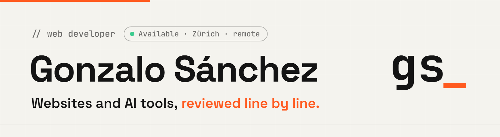

<a href="https://linkedln-gswebdeveloper.netlify.app/">
  <picture>
    <source media="(prefers-color-scheme: dark)" srcset="assets/banner-dark.png">
    
  </picture>
</a>

  
  
  

### `// about`

Junior web developer based in Zurich. I studied Web Application Development (DAW) in Spain and did an Erasmus+ internship in Berlin working on website maintenance and digital marketing.

I am looking for a junior web developer role.

### `// stack`

  
  
  
  
  
  
  
  
  

### `// selected work`

| Project | What it is | Stack |
| --- | --- | --- |
| **[GStore-App](https://github.com/GSoftware-GS/GStore-App)** | Nine small browser tools. Files are processed in the page and not uploaded | HTML, CSS, JavaScript |
| **[SnapQR](https://github.com/GSoftware-GS/SnapQR)** | QR code generator that runs fully in the browser | HTML, CSS, JavaScript |
| **[Generador-Noticias-LLM](https://github.com/GSoftware-GS/Generador-Noticias-LLM)** | DAW final project. PHP app that drafts car blog posts from RSS feeds with GPT-4 and publishes them to WordPress | PHP, OpenAI API, WordPress |
| **[ClubBoxeo](https://github.com/GSoftware-GS/ClubBoxeo)** | Gym management app with admin and member roles and appointment booking | PHP |

The older repos are mostly Python experiments from when I was learning: voice assistants, a terminal chatbot and a speech translator.
